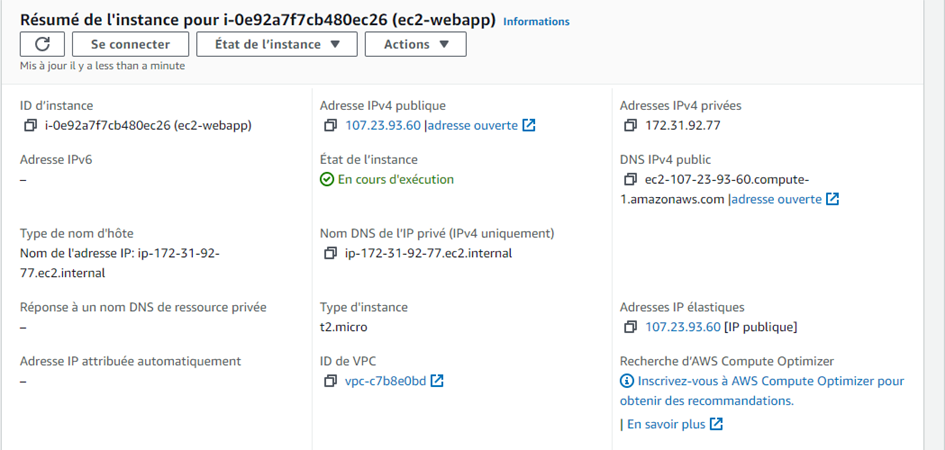

Prénom :Abdoul Gadirou
Nom :DIALLO
Promotion :BootCamp DevOps 17

# Mini-Projet Gitlab

# Application :static-website-Example

**static-website-Example** est un site web static 

# Objectif du mini projet

- Faire un fichier Dockerfile à partir duquel on va builder l'image permettant d'exécuter l'application
- Faire une pipeline CI/CD permettant de :
   - Builder l'image permettant d'executer l'application
   - Tester l'image
   - Pousser l'image dans un registre de conteneurs
   - Deployer l'application sur :
        - Un environnement de review
        - Un environnement de staging
        - l'environnement de production  

**Livrable**

- Dockerfile
- .gitlab-ci.yml
- LISEZ-MOI.md

# Infrastructure

# Récupération du code source de l'application
  Récupérer le code source de l'application depuis Github (https://github.com/diranetafen/static-website-example) et pousser sur notre depôt gitlab

 

# Ecrire du Dockerfile
  Avant d'ajouter le fichier Dockerfile j'ai créer une nouvelle branch _mini-projet-gitblab_ sur laquel je vais travail.

  Dans le fichier Dockerfile (voir Dockerfile):
  - Je suis parti d'une image  ubuntu sur lequel 
    j'ai installé Git et un serveur web en l'occurence nginx 
  - J'ai cloné les sources de l'application pour 
    avoir les derniers mises de l'application dans le conteneur après le deploiement 

# Création du pipeline CI/CD

  Pour mettre en place le CI/CD je dois créer le fichier _.gitlab-ci.yml_ à la racine du projet.
  Le CI/CD sera constitué des etapes suivants 

  - Le Build
  - Test 

# Build
 Concernant le build j'ai utilisé le mot clé "Artifact" pour que je 
  

