Prénom :Abdoul Gadirou
Nom :DIALLO
Promotion :BootCamp DevOps 17

# Mini-Projet Gitlab et Terraform

# Application :static-website-Example

**static-website-Example** est un site web static 

# Objectif du mini projet

- Faire un fichier Dockerfile à partir duquel on va builder l'image qui permettra de déployer 
  l'application
- Utiliser Terraform pour provisionner l'infrastructure de production sur laquelle l'application 
  sera déployée
- Faire un pipeline CI/CD permettant de :
   - Builder l'image qui permettra de déployer l'application
   - Tester l'image
   - Pousser l'image dans le registre de conteneurs Gitlab
   - Déployer l'application sur :
        - l'environnement de *staging* à chaque commit pour tester la non régression de 
          l'application
        - l'environnement de *review* à chaque *merge request* 
        - l'environnement de production une fois qu'on merge sur la branche *master*
 
**Livrable**

- Dockerfile
- Modules terraform (dossier app et modules)
- Fichier _.gitlab-ci.yml_
- Fichier _/templates/deploy-review.gitlab-ci.yml_
- Fichier _/templates/deploy-staging.gitlab-ci.yml_
- Fichier _/templates/terraform.gitlab-ci.yml_
- Fichier _LISEZ-MOI.md_

# Infrastructure de production
   Pour provisionner l’infrastructure de j’ai écrit 4 modules terraform et un _main_ dans le dossier _app_

   *1*-Module ec2 
   - Structure de notre module 

        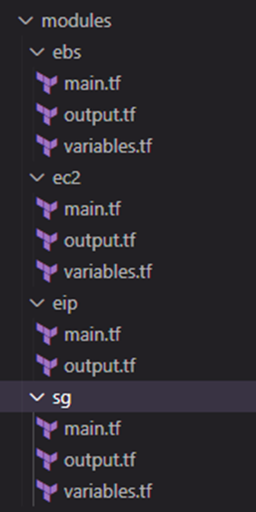

  - Dans le fichier main du module j'ai commencé par créer la _Datasource_  _aws_ami pour 
        récupérer dynamiquement la dernière version de l'AMI Ubuntu bionic
  - Ensuite je créer l’instance ec2 auquel je lie le groupe de sécurité (module sg).
  - Ensuite j'ai utilisé le provisionneur _remote-exec_ pour installer _docker_ sur la 
        machine qui sera provisionnée dans le but de pouvoir builder l’image docker qui embarque l'application _static-website-example_ 
  - Variables déclarées et qui pourront être surchargées
    - *PUBLIC_KEY* : variable d’environnement dans terraform correspondant à la variable 
              gitlab de type file qui contient la clé public de l’ec2 
    - *instancetype*: type de l'instance de l'ec2
    - *ec2_common_tag* : tag de l'instance
    - *security_groups* : nom du groupe de sécurité qui sera lié à l'instance(voir module 
                                 *sg*)
    - *ec2_instance_id*: variable de sortie permettant d'associer l'ec2 aux ebs et eip
   
  *2*-Module *ebs*

  Ce module permet de créer un volume ebs qui sera attacher à l'ec2

  - Variables déclarées et qui pourront être surchargées:
    - *availability_zone* zone de disponibilité du volume ebs qui doit être la même que la 
          zone de disponibilité de l'ec2
    - *size*: taille du volume ebs 
    - *ebs_tag*: tag du volume ebs

  *3*- Module *eip*

  Ce module permet de créer une adresse ip public qui sera lié à l'ec2
  - Variables déclarées et qui pourront être surchargées:
    - *aws_eip_id*: variable de sortie qui permettra d'associer l'ip publique à l'instance ec2

  *4* - Module *sg*

  Ce module permet de créer un groupe de sécurité pour l'ec2 en ouvrant les ports ssh (22),http (80) et https (443)
  - Variables déclarées et qui pourront être surchargées:
     - *mini_projet_sg*:Variable de sortie qui permettra d'associer le groupe de sécurité à l'instance ec2
     - *mini_projet_abdoul_sg*:variable correspondant au tag du groupe de sécurité

*5*- *Main* :
   
   Dans le fichier main.tf du dossier *app* j’appelle les 4 modules (ec2,sg,eip,ebs) pour déployer l’ec2 et pour rendre le déploiement dynamique j’ai surchargé certains variables.
      J’ai également rajouté deux ressources :
      
  - *aws_volume_attachment*: ressource permettant d’attacher le volume ebs à l’instance
  - *aws_eip_association* :ressource permettant d’associer l’ip public à l’instance.

    
# Récupération du code source de l'application
  Récupérer le code source de l'application depuis Github (https://github.com/diranetafen/static-website-example) et le pousser sur notre depôt gitlab

 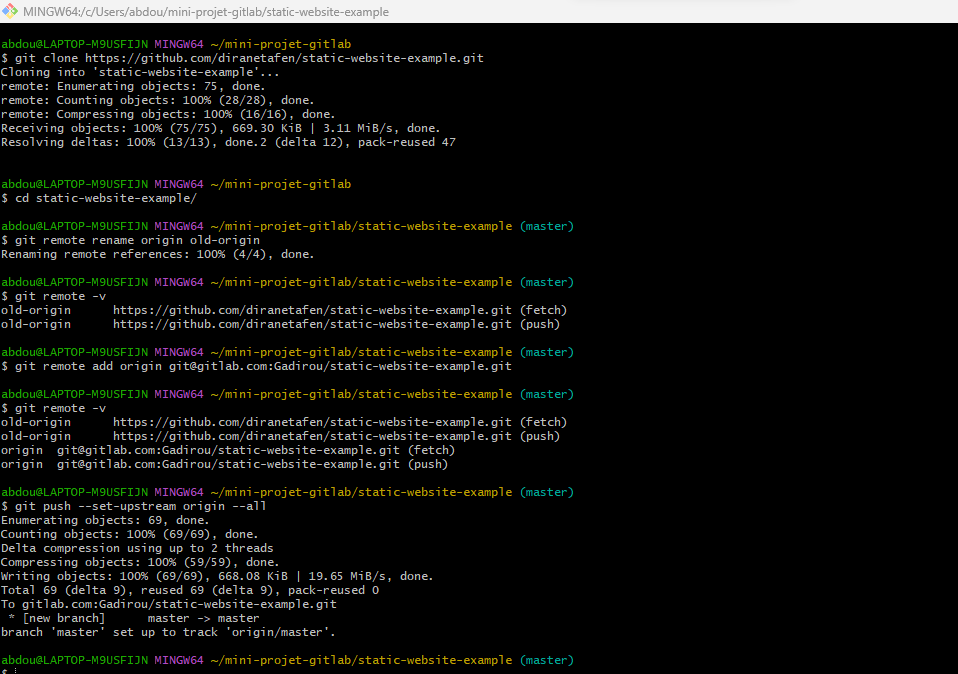

# Ecrire du Dockerfile
  Avant d'ajouter le fichier Dockerfile j'ai créer une nouvelle branch _mini-projet-gitblab_ sur laquel je vais travailler.

  Dans le fichier Dockerfile (voir Dockerfile):
  - Je suis parti d'une image _ubuntu_ sur laquel j'installe Git et un serveur web en l'occurence 
    nginx 
  - J'ai cloné les sources de l'application pour 
    avoir les derniers mises de l'application dans le conteneur après le deploiement 

# Création du pipeline CI/CD

   

  Pour mettre en place le CI/CD j'ai crée le fichier _.gitlab-ci.yml_ à la racine du projet.
  Le CI/CD sera constitué des etapes suivantes:
  - Include: qui inclut trois templates
    - 'templates/terraform.gitlab-ci.yml' :qui contient les stages permettant de provisionner l'infrastructure sur aws (module terraform) et de déployer l'application

    - 'templates/deploy-staging.gitlab-ci.yml' :qui contient les stages permettant de déployer 
     l'application sur l'environnement staging en utilisant EAZYLABS

    - 'templates/deploy-review.gitlab-ci.yml:qui contient les stages permettant de déployer 
     l'application sur l'environnement staging en utilisant EAZYLABS
  
  - before_script: A ce niveau je déclare les variables d'environnement terraform suivantes:
   TF_VAR_AWS_ACCESS_KEY_ID, TF_VAR_AWS_SECRET_ACCESS_KEY,TF_VAR_AWS_DEFAULT_REGION, PUBLIC_KEY

  - Stages:
     - Build image
     - Test acceptation
     - Release image
     - Deploy review
     - Stop review
     - Deploy staging
     - validate
     - build
     - deploy  

# Build
  Dans le job _Build_ je conteneurise l’application à partir du _Dockerfile_ 
   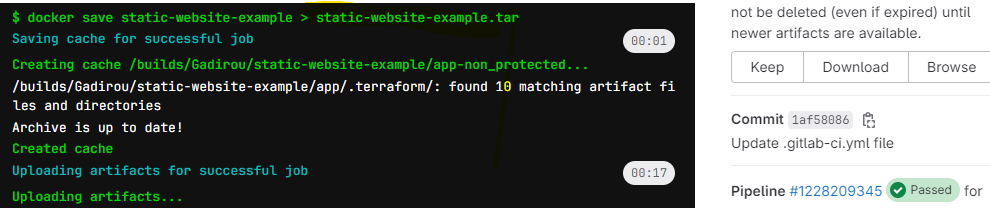

# Test acceptation
   Dans le job _Test acceptation_ j'ai testé l'image docker avant de le pousser dans le registre Gitlab-ci
   
   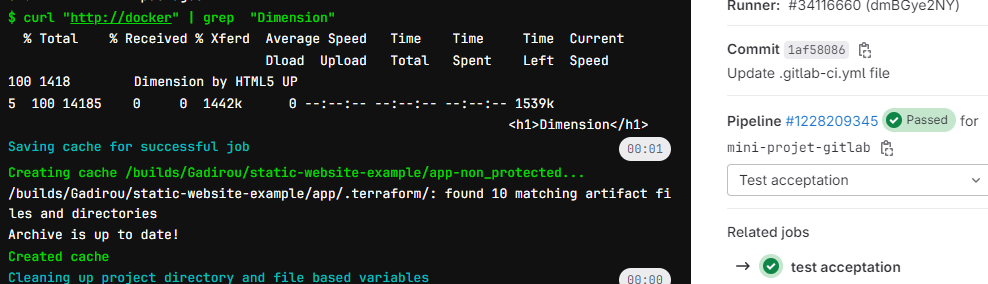

# Release image
  Une fois que le job de test d'acceptation est passe,dans le job _Release image_ je pousse l'image dans le registre Gitlab-ci
  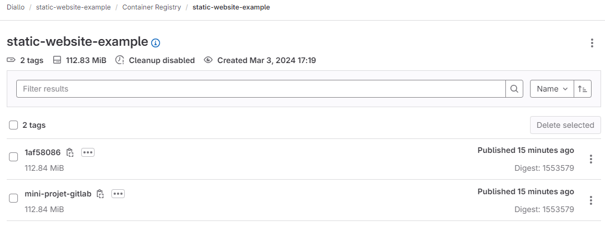

# Deploy staging avant merge sur le master 

 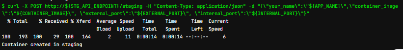

 

 

 # Test staging

   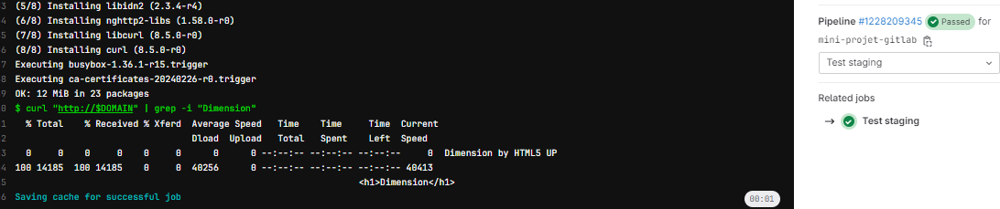

# Deploy review
  Ce job n'est executé que lorsqu'on ouvre une merge request ainsi l'application est déployée
  sur l'environnement de revue 

  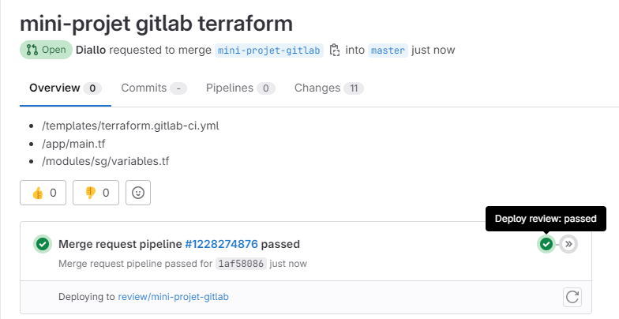

  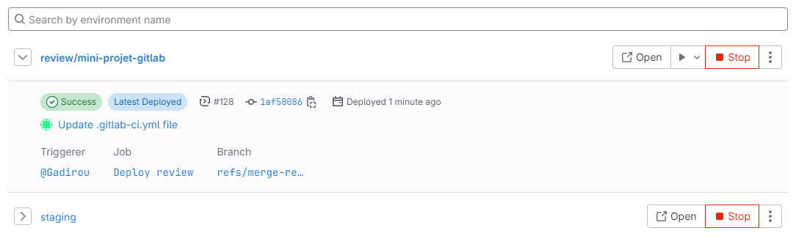

# Stop review
  Ce job est permet de supprimer l'environnement de review une fois qu'on merge sur le master

# Validate terraform infra:
  Ce job permet de valider la configuration de terraform 
  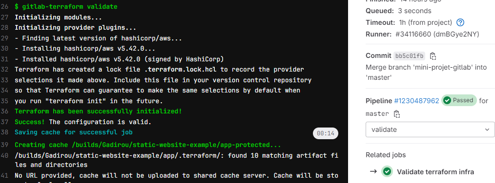

# Build terraform infra
  Ce job permet de générer le fichier _plan_ de terraform il est executé après une merge sur la branche _master_
   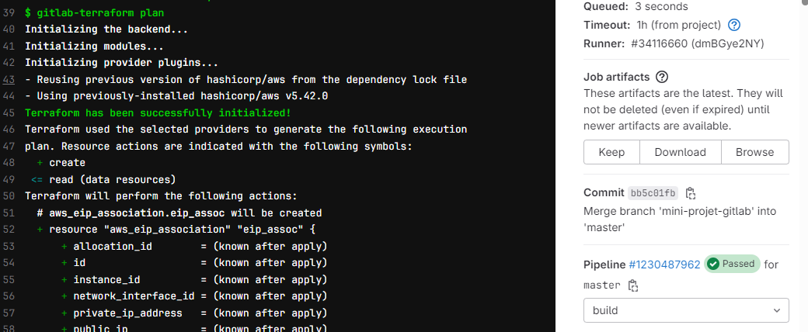

  
# deploy
  Cette job permet de provisionner l'infrastructure (ec2) à partir des modules terraform
  et de déployer l'application sur cette infrastructure.
  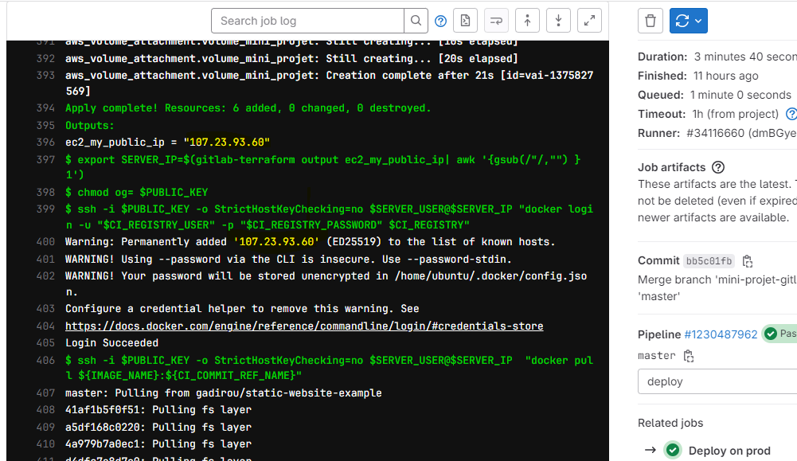

  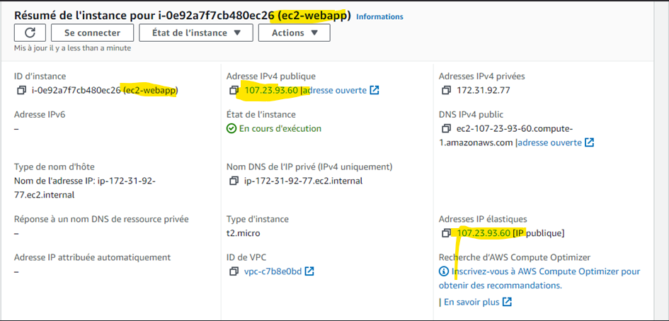

  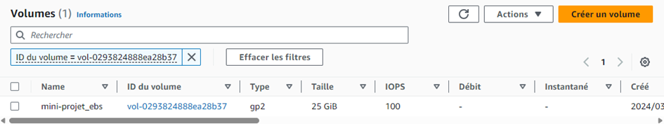

  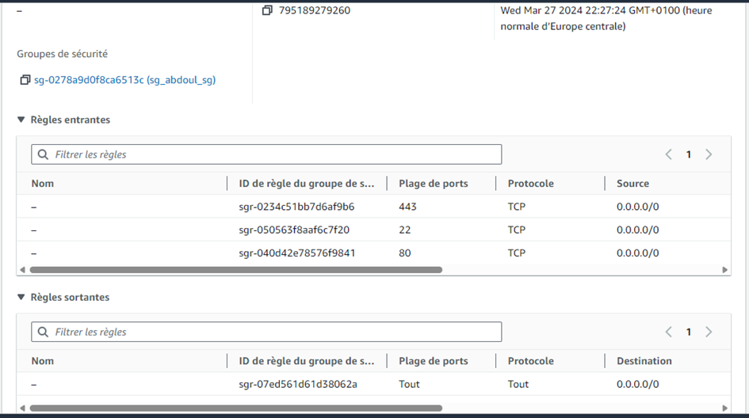

  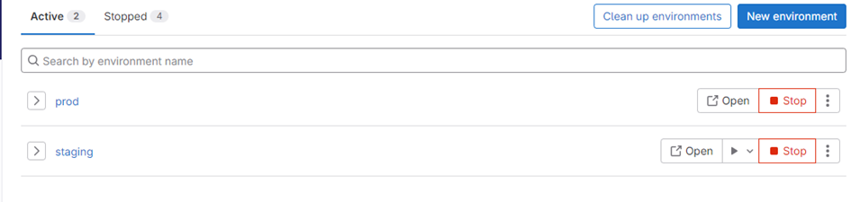

  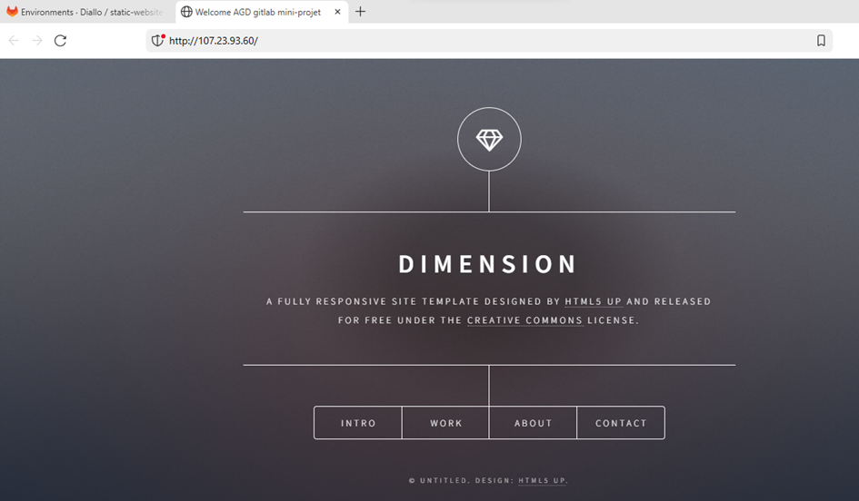

 # Test deploy 
  Dans ce job je teste l'application après la mise en _Prod_

  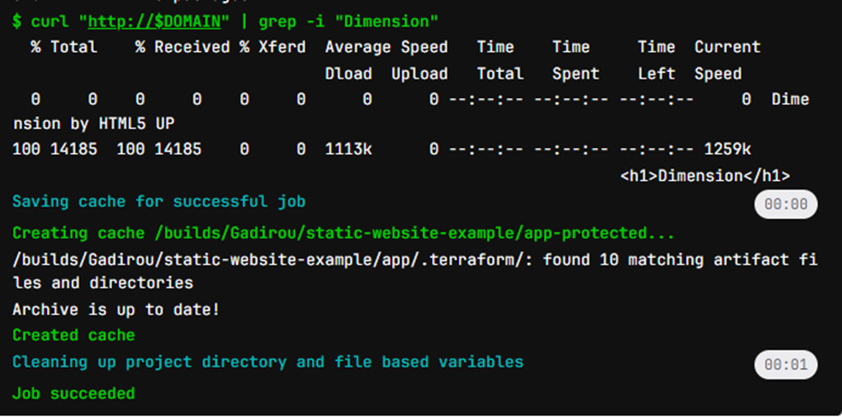

# Conclusion
 Ce projet m'a permit de mettre en pratique:
 - Le CI/CD sur Gitlab
 - l'IaC ( provisionnement d'infrastructure et deploiement d'application avez Terraform )
 - Cloud AWS 