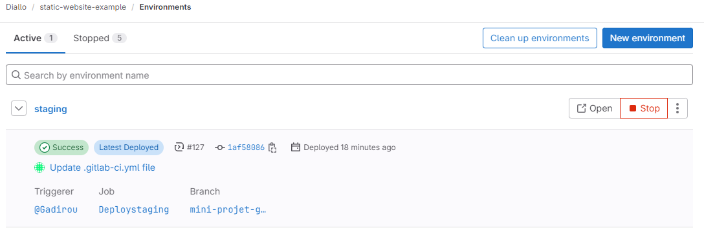
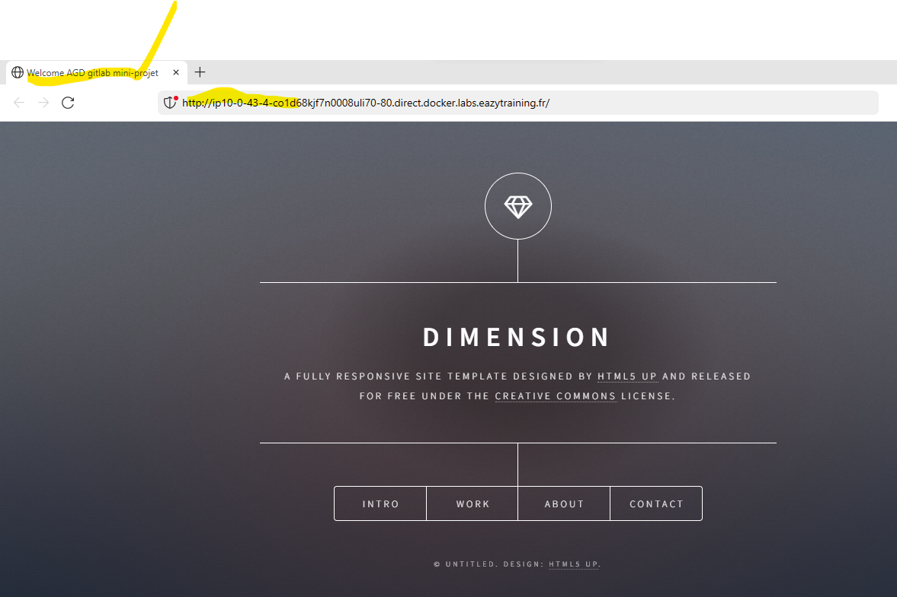
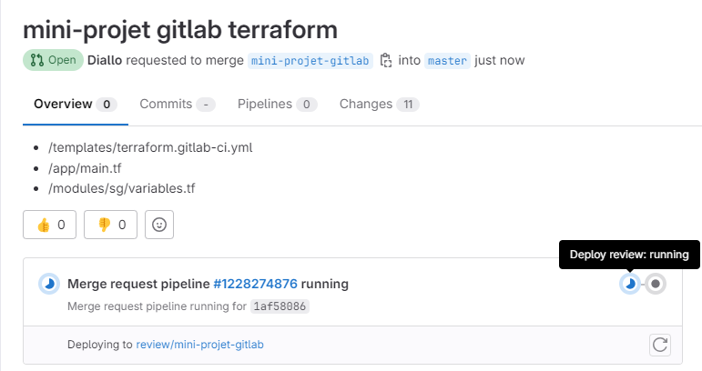

Prénom :Abdoul Gadirou
Nom :DIALLO
Promotion :BootCamp DevOps 17

# Mini-Projet Gitlab et Terraform

# Application :static-website-Example

**static-website-Example** est un site web static 

# Objectif du mini projet

- Faire un fichier Dockerfile à partir duquel on va builder l'image qui permettra de déployer l'application
- Utiliser Terraform pour provisionner l'infrastructure de production sur laquelle l'application sera déployée
- Faire une pipeline CI/CD permettant de :
   - Builder l'image qui permettra de déployer l'application
   - Tester l'image
   - Pousser l'image dans le registre de conteneurs Gitlab
   - Déployer l'application sur :
        - l'environnement de *staging* à chaque commit pour tester la non régression de 
          l'application
        - l'environnement de *review* à chaque *merge request* 
        - environnement de production une fois qu'on merge sur la branche master
 
**Livrable**

- Dockerfile
- Modules terraform (dossier app et module)
- Fichier _.gitlab-ci.yml_
- Fichier /templates/deploy-review.gitlab-ci.yml
- Fichier /templates/deploy-staging.gitlab-ci.yml
- Fichier /templates/terraform.gitlab-ci.yml
- Fichier _LISEZ-MOI.md_

# Infrastructure de production
   Pour provisionner l’infrastructure de j’ai écrit 5 modules terraform
   - Module ec2 
      - structure de notre module 
          image ici 
      - Dans le fichier main du module j'ai commencé par créer la _Datasource_  _aws_ami pour 
        récupérer dynamiquement la dernière version de l'AMI Ubuntu bionic
      - Ensuite je créer l’instance ec2 auquel je lie le groupe de sécurité (module sg).
      - Ensuite j'ai utilisé le provisionneur _remote-exec_ pour installer _docker_ sur la machine qui sera provisionnée dans le but de pouvoir builder  l’image docker qui embarque l'application _static-website-example_ 
       pour se connecter à la machine en ssh j'ai utilisé la variable *PUBLIC_KEY* dans gitlab
       - Variables déclarées et qui pourront être surchargées
           - *PUBLIC_KEY* : variable d’environnement dans terraform correspondant à la variable gitlab de type file qui contient la clé public de l’ec2 
           - *instancetype*: type de l'instance de l'ec2
           - *ec2_common_tag* : tag de l'instance
           - *security_groups* : nom du groupe de sécurité qui sera lié à l'instance(voir module *sg*)
         
           - *ec2_instance_id*: variable de sortie permettant d'associer l'ec2 aux ebs et eip
  - Module *ebs* 
      Ce module permet de créer un volume ebs qui sera attacher à l'ec2
      -Variables déclarées et qui pourront être surchargées:
        -*availability_zone* zone de disponibilité du volume ebs qui doit être le même que la zone de disponibilité de l'ec2
        -*size*: taille du volume ebs 
        -*ebs_tag*: tag du volume ebs

  - Module *eip*
     Ce module permet de créer une adresse ip public qui sera lié à l'ec2
      - Variables déclarées et qui pourront être surchargées:
        - *aws_eip_id*: variable de sortie qui permettra d'associer l'ip publique à l'instance ec2

  - Module *sg* (groupe de sécurité)
    Ce module permet de créer un groupe de sécurité pour l'ec2 en ouvrant les ports ssh (22),http (80) et https (443)
    Variables déclarées et qui pourront être surchargées:
     *mini_projet_sg*:Variable de sortie qui permettra d'associer le groupe de sécurité à l'instance ec2
     *mini_projet_abdoul_sg*:variable correspondant au tag du groupe de sécurité

  - Main :
      Dans le fichier main.tf du dossier app j’appelle les 4 modules(ec2,sg,eip,ebs) pour déployer l’ec2 pour rendre le déploiement dynamique j’ai surchargé certains variables.
      J’ai également rajouté deux ressources :
      *aws_volume_attachment* ressources permettant d’attacher le volume ebs à l’instance
      *aws_eip_association* :ressources permettant d’associer l’ip public à l’instance.

 
    
# Récupération du code source de l'application
  Récupérer le code source de l'application depuis Github (https://github.com/diranetafen/static-website-example) et pousser sur notre depôt gitlab

 

# Ecrire du Dockerfile
  Avant d'ajouter le fichier Dockerfile j'ai créer une nouvelle branch _mini-projet-gitblab_ sur laquel je vais travail.

  Dans le fichier Dockerfile (voir Dockerfile):
  - Je suis parti d'une image  ubuntu sur lequel 
    j'ai installé Git et un serveur web en l'occurence nginx 
  - J'ai cloné les sources de l'application pour 
    avoir les derniers mises de l'application dans le conteneur après le deploiement 

# Création du pipeline CI/CD

   

  Pour mettre en place le CI/CD je dois créer le fichier _.gitlab-ci.yml_ à la racine du projet.
  Le CI/CD sera constitué des etapes suivants:
  -include: qui inclut trois templates
  - 'templates/terraform.gitlab-ci.yml' :qui contient les stages permettant de provisionner l'infrastructure sur aws (module terraform) et de déployer l'application
  - 'templates/deploy-staging.gitlab-ci.yml' :qui contient les stages permettant de déployer sur l'environnement staging en utilisant EAZYLABS
  - 'templates/deploy-review.gitlab-ci.yml:qui contient les stages permettant de déployer sur l'environnement staging en utilisant EAZYLABS
  before_script: A ce niveau je déclare les variables d'environnement terraform
   TF_VAR_AWS_ACCESS_KEY_ID,TF_VAR_AWS_SECRET_ACCESS_KEY,TF_VAR_AWS_DEFAULT_REGION,PUBLIC_KEY

  - Stages:
     - Build image
     - Test acceptation
     - Release image
     - Deploy review
     - Stop review
     - Deploy staging
     - validate
     - build
     - deploy  

# Build
  Dans le job _Build_ je conteneurise l’application à partir du _Dockerfile_ 
   

# Test acceptation
   Dans le job  _Test acceptation_ j'ai testé l'application avant de le pousser dans le registre Gitlab-ci
   
# Release image
  Une fois que le job de test d'acceptation passe Dans le job _Release image_ je pousse l'image dans le registre Gitlab-ci
  

# Deploy staging avant merge sur le master 

 

 

 

 # Test staging
   

# Deploy review
  Cette job n'est executé que lorsqu'on ouvre une merge request ainsi l'application est déployée
  sur l'environnement de revue 
  

  

   
      

# Stop review
  Cette job est permet de supprimer l'environnement de review une fois que cette dernière est arrêté.

# Validate terraform infra:
  Cette job permet de valider la configuration de terraform 
  

# build ter
  Cette job permet de générer le fichier _plan_ de terraform elle est executé que sur le master

  
# deploy
  Cette job permet de provisionner l'infrastructure (ec2) à partir des modules terraform
  et de déployer l'application sur cette infrastructure.
 
